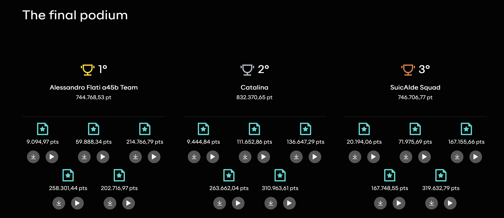

# Reply AI Challenge — Fraud Detection Pipeline

**Score: 744,768.53 pts — 1th place out of 1,971 teams**



LLM-centric fraud detection system built for the [Reply AI Challenge](https://challenges.reply.com/challenges/ai-agent/home/). The pipeline analyzes financial transactions across multiple data sources (transactions, SMS, emails, phone call recordings, GPS locations, user profiles) and uses a Large Language Model as the core decision-making engine to identify fraudulent transactions.

## Architecture Overview

```
                    ┌─────────────────┐
                    │  Dataset Folder │
                    └────────┬────────┘
                             │
              ┌──────────────┼──────────────┐
              ▼              ▼              ▼
       transactions.csv  users.json   locations.json
       mails.json        sms.json     audio/*.mp3
              │              │              │
              └──────────────┼──────────────┘
                             │
                    ┌────────▼────────┐
                    │  Step 1: LOAD   │
                    └────────┬────────┘
                             │
                    ┌────────▼────────┐
                    │ Step 2: WHISPER │  ← Transcribe mp3 → cache to JSON
                    │   TRANSCRIBE    │
                    └────────┬────────┘
                             │
                    ┌────────▼────────┐
                    │  Step 3: BUILD  │  ← Map SMS/email/calls to users
                    │ USER DOSSIERS   │  ← Classify comms (phishing/normal)
                    └────────┬────────┘
                             │
                    ┌────────▼────────┐
                    │ Step 4: FORMAT  │  ← Enrich with GPS distances,
                    │  + ANNOTATE     │     z-scores, temporal flags
                    └────────┬────────┘
                             │
                    ┌────────▼────────┐
                    │  Step 5: LLM    │  ← One call per user (parallel)
                    │ FRAUD ANALYSIS  │  ← Returns JSON array of fraud IDs
                    └────────┬────────┘
                             │
                    ┌────────▼────────┐
                    │     OUTPUT      │  → fraud_transactions.txt
                    └─────────────────┘
```

## How It Works — Step by Step

### Step 1: Data Loading

Loads all data sources from a dataset folder:

| File | Content |
|------|---------|
| `transactions.csv` | All financial transactions (ID, sender/recipient IBAN, amount, location, timestamp, description, balance) |
| `users.json` | User profiles (name, age, job, salary, home city/coordinates, personality description including phishing vulnerability) |
| `locations.json` | GPS tracking data per user (biotag ID, timestamp, lat/lng, city) |
| `sms.json` | SMS messages received by users |
| `mails.json` | Emails received by users (full HTML content) |
| `audio/*.mp3` | Phone call recordings (filename encodes timestamp + username) |

### Step 2: Audio Transcription (Whisper)

For datasets containing audio files (e.g., Deus Ex, 1984, Blade Runner):

1. Uses **OpenAI Whisper** (`base` model) to transcribe each `.mp3` file
2. Extracts timestamp and username from the filename pattern: `YYYYMMDD_HHMMSS-username.mp3`
3. **Caches results** to `audio_transcripts.json` — subsequent runs skip transcription entirely
4. Audio reveals critical evidence: **extortion calls** demanding specific amounts (e.g., "Pay 5,000 euros within 48 hours or we release compromising footage") and **scam calls** impersonating bank security

### Step 3: Communication Mapping & Classification

Maps all communications to users and classifies each as **PHISHING** or **NORMAL**.

#### SMS Mapping

SMS messages don't contain IBANs directly. The pipeline resolves phone numbers to users via:
1. **Name matching** — checks if the user's first name or full name appears in the SMS text
2. **City matching** — falls back to matching the user's residence city in the SMS content

#### Email Mapping

Extracts the recipient name from the `To: "Name" <email>` header and matches to user IBANs. Strips HTML tags to extract a body snippet for classification.

#### Audio Mapping

Maps filenames like `guido_döhn.mp3` to users. Uses **Unicode NFC normalization** to handle accented characters properly (macOS uses NFD decomposition in filenames).

#### Phishing Classification

A keyword-based classifier flags communications containing terms like:
- Urgency: `urgent`, `immediately`, `action required`, `limited time`
- Account takeover: `verify`, `suspend`, `locked`, `frozen`, `unauthorized`
- Impersonation: `bank security`, `fraud unit`, `safe account`, `escrow`
- Scams: `compromis`, `footage`, `blackmail`, `threaten`, `legal action`
- Typosquatting: `paypa1`, `amaz0n`, `paypai`, `amazom`

### Step 4: User Dossier Construction

For each user, the pipeline builds a comprehensive **dossier** containing:

#### Profile Section
- Demographics (age, job, salary, home city)
- Full personality description from `users.json` — critically, this includes **phishing vulnerability probability** (e.g., "estimated 50% chance of clicking on phishing links")

#### Communications Timeline
- All phishing/suspicious messages shown in full with dates
- Normal message count summarized
- Phone call transcripts included verbatim

#### Transaction Statistics
- Mean, median, standard deviation, and range of amounts
- Transaction type distribution

#### Annotated Transaction List

Every single transaction is listed chronologically with **deterministic flags** computed by the pipeline:

| Flag | Trigger | Purpose |
|------|---------|---------|
| `UNUSUAL_AMOUNT(+3.2σ)` | Amount >2 standard deviations from user's mean | Statistical outlier detection |
| `VERY_FAR(850km)` | GPS location >500km from home | Location anomaly |
| `FAR(200km)` | GPS location >100km from home | Moderate location anomaly |
| `PHISHING_BEFORE(3d)` | Phishing comm received within 14 days before this tx | Temporal correlation |

**GPS Distance Calculation:**
- Uses the user's **biotag** (a Unicode-safe ID like `DÖHN-GDUI-811-WIE-0`) to look up the nearest GPS data point
- Finds the closest location entry by timestamp using **binary search** (`bisect_left`)
- Computes **Haversine distance** between the GPS position and the user's home coordinates

> **Key bug fix in v3:** Previous versions used a regex `[A-Z]{4}` for biotag matching, which failed on Unicode characters (Ö, É, etc.). This caused **479 transactions** (24% of Deus Ex) to have zero GPS data. v3 uses a Unicode-safe check: split by `-`, verify 5 parts with a digit suffix.

**Recipient Information:**
- Known users: shows name and job (e.g., `→ Guido Döhn (Student)`)
- Unknown IBANs: shows as `→ external(DE71D46742...)` — potential fraud recipients

### Step 5: LLM Fraud Analysis

The core decision engine. Each user's complete dossier is sent to the LLM with a carefully engineered system prompt.

#### System Prompt Strategy

The prompt instructs the LLM to reason about fraud using a **ranked indicator framework**:

1. **Phishing → Transaction Chain** (strongest): User received a scam communication → then made an unusual payment within days matching the scam's demands
2. **Social Engineering Call → Payment**: Audio transcript shows extortion demand for specific amount → matching transfer followed
3. **Location + Amount Anomaly**: Transaction far from home with unusual amount (cross-referenced with job — consultants travel)
4. **Unknown Recipient + Unusual Amount**: Transfer to external account after phishing communications
5. **Pattern Break**: Sudden change in spending behavior

The prompt also defines explicit **false positive exclusions** — salary payments, rent, ATM withdrawals, utility bills, travel spending for traveling professionals, and nighttime direct debits.

The key reasoning rule: *a transaction being statistically unusual is NOT enough — it needs a triggering event (phishing/scam communication)*

#### Execution

- **One LLM call per user** — the LLM sees the complete context for that user
- **Parallel execution** — uses `ThreadPoolExecutor` with configurable concurrency (`MAX_CONCURRENCY`)
- **Langfuse tracing** — every call is tracked with session IDs for cost monitoring
- LLM returns a **JSON array** of fraud transaction IDs, parsed with regex fallback

### Step 6: Output

- Deduplicates and validates IDs against the original transaction set
- Writes one transaction ID per line to `fraud_transactions.txt` in the dataset folder

## Usage

```bash
# Single dataset
python main.py "Deus Ex - train"

# Multiple datasets
python main.py "1984 - validation" "Blade Runner - validation" "Deus Ex - validation"
```

## Configuration

All settings via `.env`:

```env
OPENROUTER_API_KEY=sk-or-...       # LLM API key (OpenRouter gateway)
REMOTE_MODEL=anthropic/claude-sonnet-4.6  # Model to use
MAX_CONCURRENCY=8                  # Parallel LLM calls

# Langfuse observability
LANGFUSE_PUBLIC_KEY=pk-lf-...
LANGFUSE_SECRET_KEY=sk-lf-...
LANGFUSE_HOST=https://challenges.reply.com/langfuse
TEAM_NAME=your-team-name
```

## Dependencies

```bash
pip install langchain langchain-openai "langfuse>=3,<4" python-dotenv ulid-py \
            pandas numpy tqdm openai-whisper
```

Also requires `ffmpeg` for audio processing:
```bash
brew install ffmpeg  # macOS
```

## Design Decisions

### Why LLM-centric instead of ML-first?

Previous iterations (v1: rule-based, v2: Isolation Forest + LLM) performed poorly because:
- ML pre-filtering was too aggressive — legitimate outliers got flagged while subtle social-engineering fraud was missed
- The challenge explicitly requires the **LLM to be the core decision-making layer**
- Fraud in these datasets follows a narrative pattern (phishing → victimization) that LLMs reason about naturally

### Why per-user instead of per-transaction?

Sending the LLM a user's complete transaction history + communications allows it to:
- Understand the user's **baseline spending behavior**
- See the **temporal chain**: scam received on Date X → suspicious transfer on Date X+3
- Cross-reference the user's **phishing vulnerability** with actual phishing received
- Identify **repeated victimization** patterns (same user scammed multiple times)

### Why Whisper base model?

- Audio files are short (10-20 seconds), clear speech, mostly English/German
- `base` model (139M params) provides sufficient accuracy for scam call detection
- Runs in ~0.3s per file on CPU — 48 files transcribed in ~17 seconds
- Results are cached, so transcription only happens once per dataset
